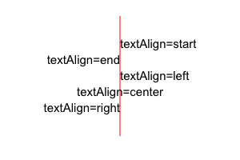
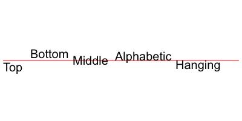
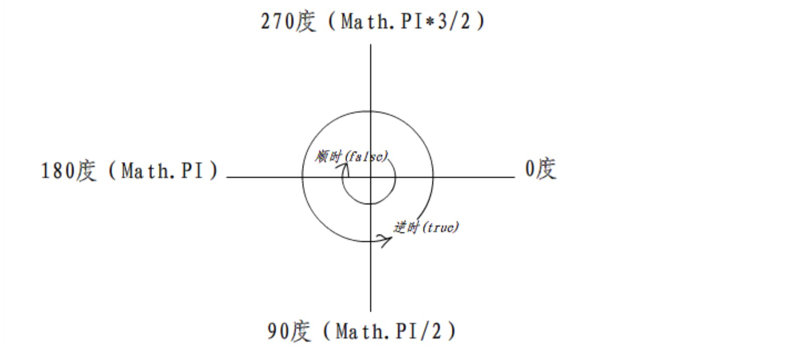
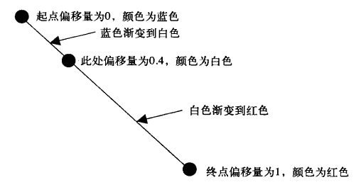
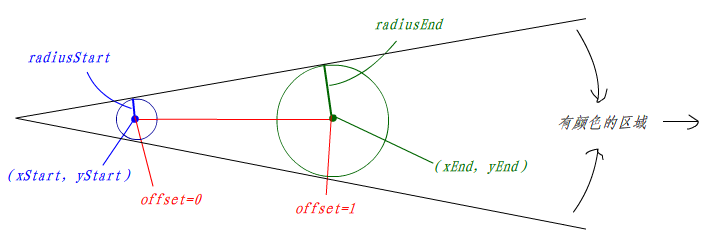

> 参考：[CANVAS BLOGS](http://www.cnblogs.com/tim-li/archive/2012/08/06/2580252.html#17)
>
> 

# # 简介

Canvas是HTML5新增的组件，它就像一块幕布，可以用JavaScript在上面绘制各种图表、动画等。

没有Canvas的年代，绘图只能借助Flash插件实现，页面不得不用JavaScript和Flash进行交互。有了Canvas，我们就再也不需要Flash了，直接使用JavaScript完成绘制。

一个Canvas定义了一个指定尺寸的矩形框，在这个范围内我们可以随意绘制：

```html
<canvas id="test-canvas" width="500" height="300"></canvas>
```

由于浏览器对HTML5标准支持不一致，所以，通常在 `<canvas>` 内部添加一些说明性HTML代码，如果浏览器支持Canvas，它将忽略 `<canvas>` 内部的HTML，如果浏览器不支持Canvas，它将显示 `<canvas>` 内部的HTML：

```html
<canvas id="test-stock" width="500" height="300">
    <p>Current Price: 25.51</p>
</canvas>
```

在使用Canvas前，用 `canvas.getContext` 来测试浏览器是否支持Canvas：

```html
<canvas id="test-canvas" width="500" heigth="300">
    <p>你的浏览器不支持Canvas</p>
</canvas>
```

```javascript
var canvas = document.getElementById('test-canvas');
if (canvas.getContext) {
    console.log('你的浏览器支持Canvas!');
} else {
    console.log('你的浏览器不支持Canvas!');
}
```

`getContext('2d') `方法让我们拿到一个 **CanvasRenderingContext2D** 对象，所有的绘图操作都需要通过这个对象完成。

```javascript
var ctx = canvas.getContext('2d');
```

如果需要绘制3D怎么办？HTML5还有一个WebGL规范，允许在Canvas中绘制3D图形：

```javascript
gl = canvas.getContext("webgl");
```

本节我们只专注于绘制2D图形。

接下来我们还需要了解下Canvas的坐标系：


Canvas的坐标以左上角为原点，水平向右为X轴，垂直向下为Y轴，以像素为单位，所以每个点都是非负整数。

Canvas元素绘制图像的时候有两种方法，分别是

- ctx.fill() ：填充
- ctx.stroke()：绘制边框

在进行图形绘制前，要设置好绘图的样式：

- ctx.fillStyle：填充的样式
- ctx.strokeStyle：边框样式

你还可以设置边框宽度：

- ctx.lineWidth

# # 开始

HTML 基本结构如下，示例中我将统一使用这个画布。

```html
<canvas class="test-canvas" width="500" height="300" style="border: 1px solid #d3d3d3">
    <p>您的浏览器不支持Canvas！</p>
</canvas>
```

## 1、文字 

- 填充文字：*context.fillText(text,x,y)*
- 绘制文字轮廓：*context.strokeText(text,x,y)*

> 参数解读：

- `text`：要绘制的文字
- `x`：文字起点的x坐标
- `y`：文字起点的y坐标

> 其他配置：

- *ctx.font*：设置字体样式

- *ctx.textAlign*：设置字体水平对齐方式（*start、end、left、right、center*）

  

- *ctx.textBaseline*：设置字体垂直对齐方式（*top、hanging、middle、alphabetic、ideographic、bottom*）

  

- *context.measureText(text)*：计算字体长度

```javascript
// 获取DOM元素
var canvas = document.querySelector(".test-canvas");
// 获取上下文（画布）
var ctx    = canvas.getContext("2d");

ctx.strokeStyle = "blue";
ctx.font = "italic 36px 微软雅黑";
ctx.textAlign = "center";
ctx.textBaseline = "middle";
ctx.strokeText("Hello, world!", 250, 150);
```


## 2、矩形

- 填充矩形：*context.fillRect(x,y,width,height)*
- 绘制矩形：*strokeRect(x,y,width,height)*

```javascript
var canvas = document.querySelector(".test-canvas");
var ctx    = canvas.getContext("2d");

// 绘制
ctx.strokeStyle = "#000";
ctx.strokeRect(50, 75, 175, 150);

// 填充
ctx.fillStyle = "#333";
ctx.fillRect(275, 75, 175, 150);
```


## 3、清除矩形区域

清除矩形区域：*context.clearRect(x,y,width,height)*

```javascript
var canvas = document.querySelector(".test-canvas");
var ctx    = canvas.getContext("2d");

ctx.strokeStyle = "#000";
ctx.strokeRect(50, 75, 175, 150);

ctx.fillStyle = "#333";
ctx.fillRect(275, 75, 175, 150);

// 清除矩形区域
ctx.clearRect(175, 110,150, 80);
```


## 4、圆弧

- 绘制圆弧：*context.arc(x, y, radius, starAngle,endAngle, anticlockwise)*

> 参数解读：

- `x`：圆心x坐标
- `y`：圆心y坐标
- `starAngle`：开始角度
- `endAngle`：结束角度
- `anticlockwise`：是否逆时针（ *true* 为逆时针，*false* 为顺时针）



```javascript
var canvas = document.querySelector(".test-canvas");
var ctx    = canvas.getContext("2d");

ctx.beginPath();
ctx.arc(125, 150, 75, 0, 2 * Math.PI, false);
ctx.closePath();
ctx.fillStyle = "#333";
ctx.fill();


ctx.beginPath();
ctx.arc(325, 150, 75, 0, 45, true);
ctx.strokeStyle = "#333";
ctx.closePath();
ctx.stroke()
```


## 5、线段

- *context.moveTo(x,y)*
- *context.lineTo(x,y)*

每次画线都从moveTo的点到lineTo的点，

如果没有moveTo那么第一次lineTo的效果和moveTo一样，

每次lineTo后如果没有moveTo，那么下次lineTo的开始点为前一次lineTo的结束点。

```javascript
var canvas = document.querySelector(".test-canvas");
var ctx    = canvas.getContext("2d");

ctx.moveTo(50, 100);
ctx.lineTo(450, 100);
ctx.stroke();

ctx.moveTo(50, 150);
ctx.lineTo(183, 150);
ctx.lineTo(250, 250);
ctx.lineTo(316, 150);
ctx.lineTo(450, 150);
ctx.strokeStyle = "#333";
ctx.stroke();
```


## 6、贝塞尔曲线

[贝塞尔曲线扫盲](http://www.html-js.com/article/1628)

[动态绘制贝塞尔曲线](http://myst729.github.io/bezier-curve/)

- 三次贝塞尔曲线：*context.bezierCurveTo(cp1x,cp1y,cp2x,cp2y,x,y)*
- 二次贝塞尔曲线：*context.quadraticCurveTo(qcpx,qcpy,qx,qy)*

```javascript
var canvas = document.querySelector(".test-canvas");
var ctx    = canvas.getContext("2d");

ctx.moveTo(50, 100);
ctx.bezierCurveTo(100, 200, 150, 50, 250, 170);
ctx.stroke();
```


## 7、线性渐变

- 创建线性渐变：*var lg =ctx.createLinearGradient(xStart,yStart,xEnd,yEnd)*
- 颜色节点：*lg.addColorStop(offset,color)*

> 参数解读

- `xstart`：渐变开始点x坐标
- `ystart`：渐变开始点y坐标

*    `xEnd`：渐变结束点x坐标


*    `yEnd`：渐变结束点y坐标
*    `offset`：设定的颜色离渐变结束点的偏移量(0~1)
*    `color`：绘制时要使用的颜色



```javascript
var canvas = document.querySelector(".test-canvas");
var ctx    = canvas.getContext("2d");

var lg = ctx.createLinearGradient(0, 0, 400, 200);
lg.addColorStop( 0, "blue");
lg.addColorStop(.4, "white");
lg.addColorStop( 1, "red");

ctx.fillStyle = lg;
ctx.fillRect(50, 50, 400, 200);
```


## 8、径向渐变

- 创建径向渐变：*rg=ctx.createRadialGradient(xStart,yStart,radiusStart,xEnd,yEnd,radiusEnd)*
- 颜色节点：*rg.addColorStop(offset,color)*



```javascript
var canvas = document.querySelector(".test-canvas");
var ctx    = canvas.getContext("2d");


var rg = ctx.createRadialGradient(250, 150, 0, 250, 150, 100);
rg.addColorStop(.1, "red");
rg.addColorStop( 1, "black");

ctx.beginPath();
ctx.arc(250, 150, 100,0, 2*Math.PI, true);
ctx.closePath();

ctx.fillStyle = rg;
ctx.fill();
```


## 9、图形变形

- 位移：*ctx.translate(x, y)*
- 旋转：*ctx.rotate(angle)*
- 缩放：*ctx.scale(x, y)*

## 10、图形组合


# # API 

> 提示：API 模块参考 [菜鸟教程](http://www.runoob.com/tags/ref-canvas.html) 

## 1、颜色、样式和阴影

| 属性                                       | 描述                    |
| ---------------------------------------- | --------------------- |
| [fillStyle](http://www.runoob.com/tags/canvas-fillstyle.html) | 设置或返回用于填充绘画的颜色、渐变或模式。 |
| [strokeStyle](http://www.runoob.com/tags/canvas-strokestyle.html) | 设置或返回用于笔触的颜色、渐变或模式。   |
| [shadowColor](http://www.runoob.com/tags/canvas-shadowcolor.html) | 设置或返回用于阴影的颜色。         |
| [shadowBlur](http://www.runoob.com/tags/canvas-shadowblur.html) | 设置或返回用于阴影的模糊级别。       |
| [shadowOffsetX](http://www.runoob.com/tags/canvas-shadowoffsetx.html) | 设置或返回阴影与形状的水平距离。      |
| [shadowOffsetY](http://www.runoob.com/tags/canvas-shadowoffsety.html) | 设置或返回阴影与形状的垂直距离。      |

| 方法                                       | 描述                    |
| ---------------------------------------- | --------------------- |
| [createLinearGradient()](http://www.runoob.com/tags/canvas-createlineargradient.html) | 创建线性渐变（用在画布内容上）。      |
| [createPattern()](http://www.runoob.com/tags/canvas-createpattern.html) | 在指定的方向上重复指定的元素。       |
| [createRadialGradient()](http://www.runoob.com/tags/canvas-createradialgradient.html) | 创建放射状/环形的渐变（用在画布内容上）。 |
| [addColorStop()](http://www.runoob.com/tags/canvas-addcolorstop.html) | 规定渐变对象中的颜色和停止位置。      |

## 2、线条样式

| [lineCap](http://www.runoob.com/tags/canvas-linecap.html) | 设置或返回线条的结束端点样式。       |
| ---------------------------------------- | --------------------- |
| [lineJoin](http://www.runoob.com/tags/canvas-linejoin.html) | 设置或返回两条线相交时，所创建的拐角类型。 |
| [lineWidth](http://www.runoob.com/tags/canvas-linewidth.html) | 设置或返回当前的线条宽度。         |
| [miterLimit](http://www.runoob.com/tags/canvas-miterlimit.html) | 设置或返回最大斜接长度。          |

## 3、矩形

| 方法                                       | 描述              |
| ---------------------------------------- | --------------- |
| [rect()](http://www.runoob.com/tags/canvas-rect.html) | 创建矩形。           |
| [fillRect()](http://www.runoob.com/tags/canvas-fillrect.html) | 绘制"被填充"的矩形。     |
| [strokeRect()](http://www.runoob.com/tags/canvas-strokerect.html) | 绘制矩形（无填充）。      |
| [clearRect()](http://www.runoob.com/tags/canvas-clearrect.html) | 在给定的矩形内清除指定的像素。 |

## 4、路径

| 方法                                       | 描述                                 |
| ---------------------------------------- | ---------------------------------- |
| [fill()](http://www.runoob.com/tags/canvas-fill.html) | 填充当前绘图（路径）。                        |
| [stroke()](http://www.runoob.com/tags/canvas-stroke.html) | 绘制已定义的路径。                          |
| [beginPath()](http://www.runoob.com/tags/canvas-beginpath.html) | 起始一条路径，或重置当前路径。                    |
| [moveTo()](http://www.runoob.com/tags/canvas-moveto.html) | 把路径移动到画布中的指定点，不创建线条。               |
| [closePath()](http://www.runoob.com/tags/canvas-closepath.html) | 创建从当前点回到起始点的路径。                    |
| [lineTo()](http://www.runoob.com/tags/canvas-lineto.html) | 添加一个新点，然后在画布中创建从该点到最后指定点的线条。       |
| [clip()](http://www.runoob.com/tags/canvas-clip.html) | 从原始画布剪切任意形状和尺寸的区域。                 |
| [quadraticCurveTo()](http://www.runoob.com/tags/canvas-quadraticcurveto.html) | 创建二次贝塞尔曲线。                         |
| [bezierCurveTo()](http://www.runoob.com/tags/canvas-beziercurveto.html) | 创建三次贝塞尔曲线。                         |
| [arc()](http://www.runoob.com/tags/canvas-arc.html) | 创建弧/曲线（用于创建圆形或部分圆）。                |
| [arcTo()](http://www.runoob.com/tags/canvas-arcto.html) | 创建两切线之间的弧/曲线。                      |
| [isPointInPath()](http://www.runoob.com/tags/canvas-ispointinpath.html) | 如果指定的点位于当前路径中，则返回 true，否则返回 false。 |

## 5、转换

| 方法                                       | 描述                             |
| ---------------------------------------- | ------------------------------ |
| [scale()](http://www.runoob.com/tags/canvas-scale.html) | 缩放当前绘图至更大或更小。                  |
| [rotate()](http://www.runoob.com/tags/canvas-rotate.html) | 旋转当前绘图。                        |
| [translate()](http://www.runoob.com/tags/canvas-translate.html) | 重新映射画布上的 (0,0) 位置。             |
| [transform()](http://www.runoob.com/tags/canvas-transform.html) | 替换绘图的当前转换矩阵。                   |
| [setTransform()](http://www.runoob.com/tags/canvas-settransform.html) | 将当前转换重置为单位矩阵。然后运行 transform()。 |

## 6、文本

| 属性                                       | 描述                    |
| ---------------------------------------- | --------------------- |
| [font](http://www.runoob.com/tags/canvas-font.html) | 设置或返回文本内容的当前字体属性。     |
| [textAlign](http://www.runoob.com/tags/canvas-textalign.html) | 设置或返回文本内容的当前对齐方式。     |
| [textBaseline](http://www.runoob.com/tags/canvas-textbaseline.html) | 设置或返回在绘制文本时使用的当前文本基线。 |

| 方法                                       | 描述              |
| ---------------------------------------- | --------------- |
| [fillText()](http://www.runoob.com/tags/canvas-filltext.html) | 在画布上绘制"被填充的"文本。 |
| [strokeText()](http://www.runoob.com/tags/canvas-stroketext.html) | 在画布上绘制文本（无填充）。  |
| [measureText()](http://www.runoob.com/tags/canvas-measuretext.html) | 返回包含指定文本宽度的对象。  |

## 7、图像绘制

| 方法                                       | 描述              |
| ---------------------------------------- | --------------- |
| [drawImage()](http://www.runoob.com/tags/canvas-drawimage.html) | 向画布上绘制图像、画布或视频。 |

## 8、像素操作

| 属性                                       | 描述                               |
| ---------------------------------------- | -------------------------------- |
| [width](http://www.runoob.com/tags/canvas-imagedata-width.html) | 返回 ImageData 对象的宽度。              |
| [height](http://www.runoob.com/tags/canvas-imagedata-height.html) | 返回 ImageData 对象的高度。              |
| [data](http://www.runoob.com/tags/canvas-imagedata-data.html) | 返回一个对象，其包含指定的 ImageData 对象的图像数据。 |

| 方法                                       | 描述                                  |
| ---------------------------------------- | ----------------------------------- |
| [createImageData()](http://www.runoob.com/tags/canvas-createimagedata.html) | 创建新的、空白的 ImageData 对象。              |
| [getImageData()](http://www.runoob.com/tags/canvas-getimagedata.html) | 返回 ImageData 对象，该对象为画布上指定的矩形复制像素数据。 |
| [putImageData()](http://www.runoob.com/tags/canvas-putimagedata.html) | 把图像数据（从指定的 ImageData 对象）放回画布上。      |

## 9、合成

| 属性                                       | 描述                     |
| ---------------------------------------- | ---------------------- |
| [globalAlpha](http://www.runoob.com/tags/canvas-globalalpha.html) | 设置或返回绘图的当前 alpha 或透明值。 |
| [globalCompositeOperation](http://www.runoob.com/tags/canvas-globalcompositeoperation.html) | 设置或返回新图像如何绘制到已有的图像上。   |

## 10、其他

| 方法            | 描述               |
| ------------- | ---------------- |
| save()        | 保存当前环境的状态。       |
| restore()     | 返回之前保存过的路径状态和属性。 |
| createEvent() |                  |
| getContext()  |                  |
| toDataURL()   |                  |